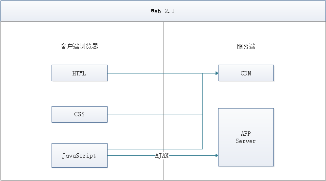
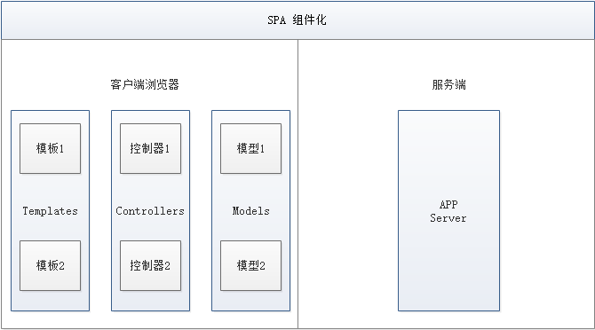
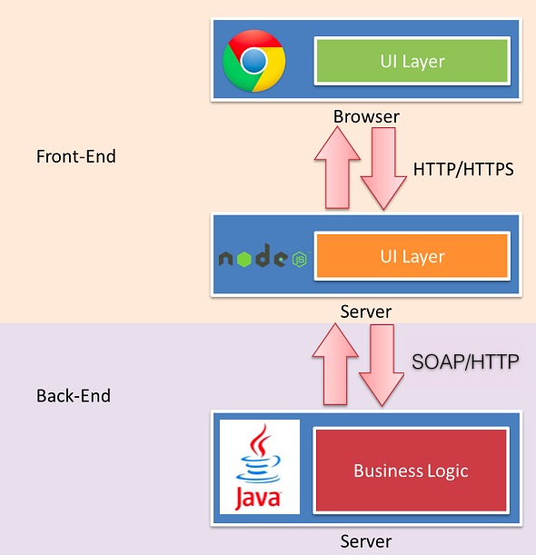
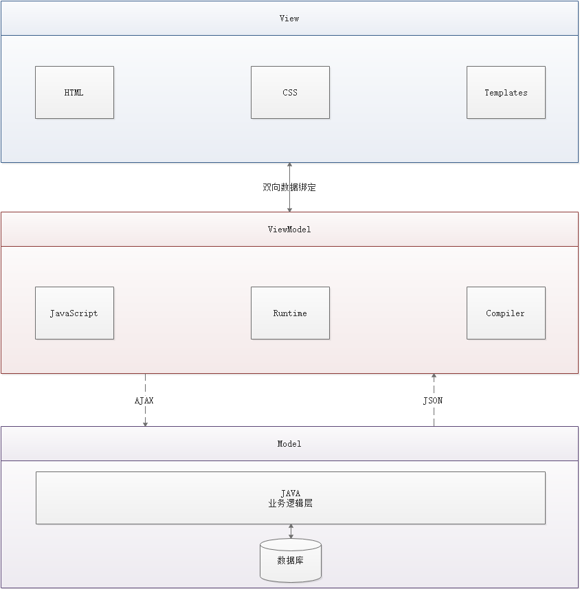

# 介绍

## Vue 渐进式框架

- 逐渐增强，浏览器版本越高，增加的效果越多
- 核心库只关系视图
- 第三方库
  - vue-router，页面跳转
  - vuex ，状态管理，之前后端的session功能
  - axios，http访问

## 前端三要素

### html

### css

- 问题
  - 标记语言，非编程语言
  - 不存在自定义变量
  - 不可以引用
- 解决：css预处理器
  - SASS：基于Ruby，服务端处理，功能强，需要学习Ruby，上手难
  - ==LESS==：基于nodeJs，客户端处理，使用简单，效率低于SASS

### js

- native js 原生js开发

- ECMAScript
  - ES5所有浏览器支持
  - ES6，常用，当前主流版本
    - 使用ES6写程序，使用webpack编译转换为ES5
- TypeScript
  - 微软开发
  - js的超集
  - 基于类的面向对象
- js框架
  - jquery
    - 简化了dom操作
    - 操作dom太频繁
    - 影响前端性能
    - 兼容IE678使用
  - Angular
    - google的前端框架
    - java程序员开发
    - 增加模块化概念
    - 采用TypeScript开发
    - 版本迭代不合理，不同版本没有关联性
  - React
    - Facebook出品
    - 新概念：虚拟DOM
      - 减少真实DOM操作
      - 在内存中模拟操作DOM，最后再渲染
      - 提升性能
    - 使用复杂，需要学习JSX语言
  - Vue
    - 实现了模块化开发（Angular）
    - 虚拟DOM（React）
    - 使用原生js开发
    - 实现了路由，状态管理新特性
    - 有之前框架的优点
    - SoC原创：关注度分离原则
  - Axios
    - 前端通信框架
    - 与JQuery的Ajax功能类似

## UI框架

- Ant-Design
  - alibaba出品
  - 基于React
- ElementUI
  - 饿了么出品
  - 基于Vue
- iview
  - 基于Vue
- Bootstrap
  - twitter出品
- AmazeUI
  - HTML5跨屏前端框架
- ice 飞冰
  - alibaba
  - https://ice.work/docs/iceworks
  - 大量领域模板

## JS构建工具

- Babel
  - js编译工具
  - 用于浏览器不支持的ES6新特性
  - 可以编译TypeScript
- WebPack
  - 模块打包器
  - 打包，压缩，合并，按序加载

## 三端统一

- 混合开发

- PC，安卓，IOS

- 中间件调用底层硬件（陀螺仪，GPS，摄像头）

- js调用中间件

- 云打包

  - HBuildX，DCloud出品
    - 将程序打包成.apk和.ipa程序
  - API Cloud

- 本地打包

  - Cordova

- 微信小程序

  - WeUI

    

## 后端技术

- NodeJs 框架
  - Express
  - Koa，Express的简化版本，后端开发框架
  - NPM，类似于Maven的项目管理工具
  - YARN，NPM的替代方案，类似于Gradle与Maven的关系 

## 前后分离

- web1.0

  - 2005年之前
  - jsp， php

- web2.0

  - 基于ajax兴起
  - spa 单页面应用

### 前端为主的MV* 时代

- MVC（同步通信为主）：Model、View、Controller
- MVP（异步通信为主）：Model、View、Presenter
- MVVM（异步通信为主）：Model、View、ViewModel

为了降低前端开发复杂度，涌现了大量的前端框架，比如：`AngularJS`、`React`、`Vue.js`、`EmberJS`等，这些框架总的原则是先按类型分层，比如 Templates、Controllers、Models，然后再在层内做切分，

#### 优点

- **前后端职责很清晰：** 前端工作在浏览器端，后端工作在服务端。清晰的分工，可以让开发并行，测试数据的模拟不难，前端可以本地开发。后端则可以专注于业务逻辑的处理，输出 RESTful（可以参考 [**【如何设计一个良好的 API】**](https://www.funtl.com/zh/apache-http-client/你怎么理解-RESTful.html#你怎么理解-restful)）等接口。
- **前端开发的复杂度可控：** 前端代码很重，但合理的分层，让前端代码能各司其职。这一块蛮有意思的，简单如模板特性的选择，就有很多很多讲究。并非越强大越好，限制什么，留下哪些自由，代码应该如何组织，所有这一切设计，得花一本书的厚度去说明。
- **部署相对独立：** 可以快速改进产品体验

#### 缺点

- 代码不能复用。比如后端依旧需要对数据做各种校验，校验逻辑无法复用浏览器端的代码。如果可以复用，那么后端的数据校验可以相对简单化。
- 全异步，对 SEO 不利。往往还需要服务端做同步渲染的降级方案。
- 性能并非最佳，特别是移动互联网环境下。
- SPA 不能满足所有需求，依旧存在大量多页面应用。URL Design 需要后端配合，前端无法完全掌控

### NodeJs的全栈时代

前端为主的 MV* 模式解决了很多很多问题，但如上所述，依旧存在不少不足之处。随着 NodeJS 的兴起，JavaScript 开始有能力运行在服务端。这意味着可以有一种新的研发模式

在这种研发模式下，前后端的职责很清晰。对前端来说，两个 UI 层各司其职：

- Front-end UI layer 处理浏览器层的展现逻辑。通过 CSS 渲染样式，通过 JavaScript 添加交互功能，HTML 的生成也可以放在这层，具体看应用场景。
- Back-end UI layer 处理路由、模板、数据获取、Cookie 等。通过路由，前端终于可以自主把控 URL Design，这样无论是单页面应用还是多页面应用，前端都可以自由调控。后端也终于可以摆脱对展现的强关注，转而可以专心于业务逻辑层的开发。

通过 Node，Web Server 层也是 JavaScript 代码，这意味着部分代码可前后复用，需要 SEO 的场景可以在服务端同步渲染，由于异步请求太多导致的性能问题也可以通过服务端来缓解。前一种模式的不足，通过这种模式几乎都能完美解决掉。

与 JSP 模式相比，全栈模式看起来是一种回归，也的确是一种向原始开发模式的回归，不过是一种螺旋上升式的回归。

基于 NodeJS 的全栈模式，依旧面临很多挑战：

- 需要前端对服务端编程有更进一步的认识。比如 TCP/IP 等网络知识的掌握。
- NodeJS 层与 Java 层的高效通信。NodeJS 模式下，都在服务器端，RESTful HTTP 通信未必高效，通过 SOAP 等方式通信更高效。一切需要在验证中前行。
- 对部署、运维层面的熟练了解，需要更多知识点和实操经验。
- 大量历史遗留问题如何过渡。这可能是最大最大的阻力

# 了解MVVM模式

## 什么是 MVVM

MVVM（Model-View-ViewModel）是一种软件架构设计模式，由微软 WPF（用于替代 WinForm，以前就是用这个技术开发桌面应用程序的）和 Silverlight（类似于 Java Applet，简单点说就是在浏览器上运行的 WPF） 的架构师 Ken Cooper 和 Ted Peters 开发，是一种简化用户界面的**`事件驱动编程方式`**。由 John Gossman（同样也是 WPF 和 Silverlight 的架构师）于 2005 年在他的博客上发表。

MVVM 源自于经典的 MVC（Model-View-Controller）模式（期间还演化出了 MVP（Model-View-Presenter） 模式）。**MVVM 的核心是 ViewModel 层**，负责转换 Model 中的数据对象来让数据变得更容易管理和使用，其作用如下：

- 该层向上与视图层进行双向数据绑定
- 向下与 Model 层通过接口请求进行数据交互

MVVM 已经相当成熟了，主要运用但不仅仅在网络应用程序开发中。当下流行的 MVVM 框架有 `Vue.js`，`AngularJS` 等。

## 为什么要使用 MVVM

MVVM 模式和 MVC 模式一样，主要目的是分离视图（View）和模型（Model），有几大好处

- **低耦合：** 视图（View）可以独立于 Model 变化和修改，一个 ViewModel 可以绑定到不同的 View 上，当 View 变化的时候 Model 可以不变，当 Model 变化的时候 View 也可以不变。
- **可复用：** 你可以把一些视图逻辑放在一个 ViewModel 里面，让很多 View 重用这段视图逻辑。
- **独立开发：** 开发人员可以专注于业务逻辑和数据的开发（ViewModel），设计人员可以专注于页面设计。
- **可测试：** 界面素来是比较难于测试的，而现在测试可以针对 ViewModel 来写。

## MVVM 的组成部分

### View

View 是视图层，也就是用户界面。前端主要由 HTML 和 CSS 来构建，为了更方便地展现 ViewModel 或者 Model 层的数据，已经产生了各种各样的前后端模板语言，比如 `FreeMarker`、`Thymeleaf` 等等，各大 MVVM 框架如 `Vue.js`，`AngularJS`，`EJS` 等也都有自己用来构建用户界面的内置模板语言。

### Model

Model 是指数据模型，泛指后端进行的各种业务逻辑处理和数据操控，主要围绕数据库系统展开。这里的难点主要在于需要和前端约定统一的 **接口规则**

### ViewModel

ViewModel 是由前端开发人员组织生成和维护的视图数据层。在这一层，前端开发者对从后端获取的 Model 数据进行转换处理，做二次封装，以生成符合 View 层使用预期的视图数据模型。

**需要注意的是 ViewModel 所封装出来的数据模型包括视图的状态和行为两部分，而 Model 层的数据模型是只包含状态的**

- 比如页面的这一块展示什么，那一块展示什么这些都属于视图状态（展示）
- 页面加载进来时发生什么，点击这一块发生什么，这一块滚动时发生什么这些都属于视图行为（交互）

视图状态和行为都封装在了 ViewModel 里。这样的封装使得 ViewModel 可以完整地去描述 View 层`。由于实现了双向绑定，ViewModel 的内容会实时展现在 View 层，这是激动人心的，因为前端开发者再也不必低效又麻烦地通过操纵 DOM 去更新视图。

MVVM 框架已经把最脏最累的一块做好了，我们开发者只需要处理和维护 ViewModel，更新数据视图就会自动得到相应更新，真正实现 `事件驱动编程`。

View 层展现的不是 `Model` 层的数据，而是 `ViewModel` 的数据，由 `ViewModel` 负责与 `Model` 层交互，`这就完全解耦了 View 层和 Model 层，这个解耦是至关重要的，它是前后端分离方案实施的重要一环`

