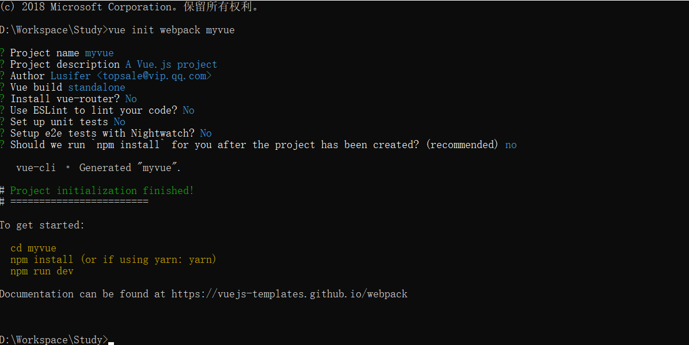

# 介绍

`vue-cli` 官方提供的一个脚手架（预先定义好的目录结构及基础代码，咱们在创建 Maven 项目时可以选择创建一个骨架项目，这个骨架项目就是脚手架


## 主要功能

- 统一的目录结构
- 本地调试
- 热部署
- 单元测试
- 集成打包上线


## 环境

- Node.js（>= 6.x，首选 8.x）
- git


# 安装


## 安装 Node.js

- http://nodejs.cn/download 官网下载安装

- 安装 Node.js 淘宝镜像加速器（`cnpm`）

```bash
npm install cnpm -g

# 或使用如下语句解决 npm 速度慢的问题
npm install --registry=https://registry.npm.taobao.org
```

- 尽量不要使用cnpm，可能会导致某些bug产生
- -g 表示全局安装，安装目录如下
  - C:\Users\Administrator\AppData\Roaming\npm\node_modules\cnpm


## 安装vue-cli

```bash
npm install vue-cli -g
```

- 检查 vue命令是否可用

```bash
Administrator@USER-20181224KT MINGW64 /e
$ vue
Usage: vue <command> [options]

Options:
  -V, --version  output the version number
  -h, --help     output usage information

Commands:
  init           generate a new project from a template
  list           list available official templates
  build          prototype a new project
  create         (for v3 warning only)
  help [cmd]     display help for [cmd]
```

```bash
Administrator@USER-20181224KT MINGW64 /e
$ vue list

  Available official templates:

  ★  browserify - A full-featured Browserify + vueify setup with hot-reload, linting & unit testing.
  ★  browserify-simple - A simple Browserify + vueify setup for quick prototyping.
  ★  pwa - PWA template for vue-cli based on the webpack template
  ★  simple - The simplest possible Vue setup in a single HTML file
  ★  webpack - A full-featured Webpack + vue-loader setup with hot reload, linting, testing & css extraction.
  ★  webpack-simple - A simple Webpack + vue-loader setup for quick prototyping.
```


# 初始化项目


## 创建项目

- 基于webpack模板的vue应用程序
- 在cmd中键入命令

```bash
# 这里的 myvue 是项目名称，可以根据自己的需求起名
vue init webpack myvue
```



- 这里简单起见，都选择no
- 选择runtime+（使用上下按键选择）

- 最后一个初始化选项，选择No，自己进行初始化


### 说明

- `Project name`：项目名称，默认 `回车` 即可
- `Project description`：项目描述，默认 `回车` 即可
- `Author`：项目作者，默认 `回车` 即可
- `Install vue-router`：是否安装 `vue-router`，选择 `n` 不安装（后期需要再手动添加）
- `Use ESLint to lint your code`：是否使用 `ESLint` 做代码检查，选择 `n` 不安装（后期需要再手动添加）
- `Set up unit tests`：单元测试相关，选择 `n` 不安装（后期需要再手动添加）
- `Setup e2e tests with Nightwatch`：单元测试相关，选择 `n` 不安装（后期需要再手动添加）
- `Should we run npm install for you after the project has been created`：创建完成后直接初始化，选择 `n`，我们手动执行


## 初始化并运行

- 在项目目录下输入cmd，在输入如下命令下载依赖

```bash
E:\study\front-end\code\vue\03.vue-cli-demo>npm install
```

- 运行

```bash
npm run dev
```

- 访问localhost:8080


# vue-cli目录结构

- build 和 config：WebPack 配置文件
- node_modules：用于存放 `npm install` 安装的依赖文件
- **src：** 项目源码目录
- static：静态资源文件
- .babelrc：Babel 配置文件，主要作用是将 ES6 转换为 ES5
- .editorconfig：编辑器配置
- eslintignore：需要忽略的语法检查配置文件
- .gitignore：git 忽略的配置文件
- .postcssrc.js：css 相关配置文件，其中内部的 `module.exports` 是 NodeJS 模块化语法
- index.html：首页，仅作为模板页，实际开发时不使用
- package.json：项目的配置文件
  - name：项目名称
  - version：项目版本
  - description：项目描述
  - author：项目作者
  - scripts：封装常用命令
    - 如`"start": "npm run dev"`，使用`npm start` 等于执行`npm run dev`
  - dependencies：生产环境依赖
  - devDependencies：开发环境依赖


## src

`src` 目录是项目的源码目录，所有代码都会写在这里


### main.js

项目的入口文件，我们知道所有的程序都会有一个入口

```javascript
// The Vue build version to load with the `import` command
// (runtime-only or standalone) has been set in webpack.base.conf with an alias.
import Vue from 'vue'
import App from './App'

Vue.config.productionTip = false

/* eslint-disable no-new */
new Vue({
  el: '#app',
  components: { App },
  template: '<App/>'
})
```

- `import Vue from 'vue'`：ES6 写法，会被转换成 `require("vue");` （require 是 NodeJS 提供的模块加载器）
- `import App from './App'`：意思同上，但是指定了查找路径，`./` 为当前目录
- `Vue.config.productionTip = false`：关闭浏览器控制台关于环境的相关提示，如开发环境的警告
- `new Vue({...})`：实例化 Vue
  - `el: '#app'`：查找 index.html 中 id 为 app 的元素
  - `template: '<App/>'`：模板，会将 index.html 中 `<div id="app"></div>` 替换为 `<App />`
  - `components: { App }`：引入组件，使用的是 `import App from './App'` 定义的 App 组件


### App.vue

组件模板

```vue
<template>
  <div id="app">
    
    <HelloWorld/>
  </div>
</template>

<script>
import HelloWorld from './components/HelloWorld'

export default {
  name: 'App',
  components: {
    HelloWorld
  }
}
</script>

<style>
#app { // 全局样式定义
  <!-- 字体 -->
  font-family: 'Avenir', Helvetica, Arial, sans-serif;
  <!-- 文字平滑效果 -->
  -webkit-font-smoothing: antialiased;
  -moz-osx-font-smoothing: grayscale;
  text-align: center;
  color: #2c3e50;
  margin-top: 60px;
}
</style>
```

- `template`：HTML 代码模板，会替换 `<App />` 中的内容
- `import HelloWorld from './components/HelloWorld'`：引入 HelloWorld 组件，用于替换 `template`中的 `<HelloWorld/>`
- `export default{...}`：导出 NodeJS 对象，作用是可以通过`import`关键字导入
  - `name: 'App'`：定义组件的名称
  - `components: { HelloWorld }`：定义子组件


### HelloWorld.vue

基本同上，不解释..

关于 `<style scoped>` 的说明：CSS 样式仅在当前组件有效，声明了样式的作用域


## 关于目录写法

- ./这是相对路径的意思，同级目录
- ../上级目录
- @/这是webpack设置的路径别名
- 在build/webpack.base.conf这个文件里面设置了@具体指的是什么

```js
resolve: {
// 路径别名
alias: {
'@': resolve('src'),
'vue$': 'vue/dist/vue.esm.js'
}
},
```

- @代表到src这个文件夹的路径